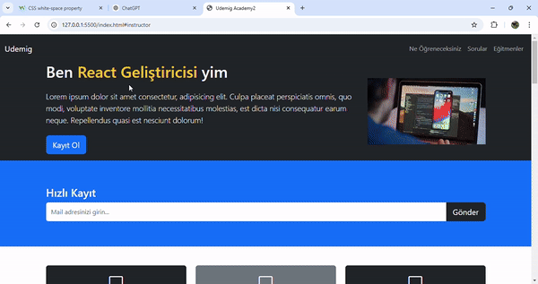

# 🏠Udemig-Academy2-Website

In this repo, a construction website was designed using Html, Css and Bootstrap.

# 🚀Features

-Responsive Design

-User-Friendly Interface

-Dynamic Navbar

-Carousel Structure

-Accordion Structure

# 🛠️Technologies Used

-Html

-Css

-Js

-Bootstrap

# Screenshot

# 📨Contact

Please contact us for your questions, comments and suggestions.:fratsbht@icloud.com

